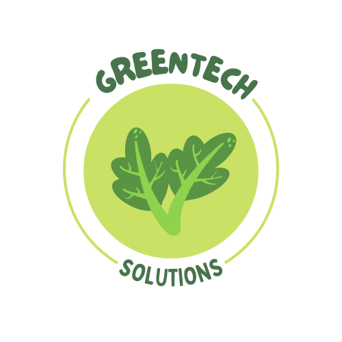

# 🌿 GreenTech Solutions - Atmospheric Monitoring Dashboard



## 📌 Overview

A cutting-edge interactive dashboard for real-time air quality monitoring, developed with Python, Dash, and MongoDB. This solution provides comprehensive visualizations of atmospheric pollutant levels, enabling users to analyze trends, identify critical areas, and make data-driven environmental decisions.

## ✨ Key Features

### 📊 Data Visualization
- **Real-time monitoring** of air quality metrics
- **Historical data analysis** with customizable time ranges
- **Geospatial heatmap** showing pollution concentration
- **Interactive charts** with hover details and zoom capabilities

### 🔍 Advanced Functionality
- **Multi-layer filtering** by:
  - Geographic region (state/city)
  - Pollutant type (PM2.5, PM10, O3, etc.)
  - Monitoring station
  - Date/time range
  - Value thresholds
- **Predictive analytics** with forecast data
- **Risk assessment** with color-coded alerts

### 🛠 Technical Highlights
- **User authentication** system
- **Responsive design** for all devices
- **Automatic updates** (hourly data refresh)
- **Export-ready** visualizations
- **Customizable thresholds** for different pollutants

## 🛠 Technology Stack

### Frontend
| Technology | Purpose |
|------------|---------|
| Dash (Python) | Interactive web framework |
| Plotly | Advanced data visualizations |
| Dash Bootstrap Components | UI layout and styling |
| HTML5/CSS3/JS | Static pages and animations |

### Backend
| Component | Description |
|-----------|-------------|
| Python 3.10+ | Core application logic |
| Flask | Web server implementation |
| PyMongo | MongoDB connectivity |
| Pandas | Data processing and analysis |

### Database
- **MongoDB Atlas** (Cloud-based NoSQL)
  - Scalable document storage
  - Geospatial indexing
  - Aggregation pipelines

### Deployment Options
- Local development
- Cloud platforms (Heroku, AWS, GCP)
- Docker containerization

## 🚀 Installation Guide

### Prerequisites
- Python 3.10+
- MongoDB Atlas account (or local MongoDB instance)
- Node.js (for optional frontend development)

### Step-by-Step Setup

1. **Clone the repository**:
   ```bash
   git clone https://github.com/your-username/greentech-dashboard.git
   cd greentech-dashboard
   ```

2. **Set up virtual environment**:
   ```bash
   python -m venv venv
   source venv/bin/activate  # Linux/Mac
   venv\Scripts\activate     # Windows
   ```

3. **Install dependencies**:
   ```bash
   pip install -r requirements.txt
   ```

4. **Configure MongoDB connection**:
   Edit `app.py` with your credentials:
   ```python
   client = MongoClient("mongodb+srv://<username>:<password>@cluster0.7gchhux.mongodb.net/...")
   ```

5. **Launch the application**:
   ```bash
   python app.py
   ```

6. **Access the dashboard**:
   Open your browser to:
   ```
   http://localhost:8050
   ```

## 🏗 Project Structure

```
greentech-air-dashboard/
├── app.py                # Main application (Dash/Flask)
├── home.html             # Welcome page (post-login)
├── login.html            # Authentication page
├── assets/               # Static resources
│   ├── logo.png          # Application logo
│   ├── styles.css        # Custom styles
│   └── favicon.ico       # Browser icon
├── requirements.txt      # Python dependencies
├── LICENSE               # MIT License
└── README.md             # Documentation
```

## 🖥 User Guide

### 🔐 Authentication
- **Test credentials**:
  - Usernames: `Abril`, `Jose`, `Lulu`
  - Password: `123` (for all test users)

### 🗺 Navigation
1. **Measurements**: Real-time sensor data
2. **Forecasts**: Predictive air quality models
3. **Analysis Tools**: Advanced data exploration

### ⚙ Filtering Options
- **Temporal filters**:
  - Date range picker
  - Hourly sliders
- **Value thresholds**: Set min/max concentration levels
- **Location-based**: Drill down by state → city → station

### 📈 Visualization Tools
1. **Time Series Chart**:
   - Multiple trend lines
   - Interactive legend
   - Data point inspection

2. **Pollution Map**:
   - OpenStreetMap base
   - Color-scaled markers
   - Station-specific details

3. **Pollutant Analysis**:
   - Box plot distributions
   - Comparative analysis
   - Outlier detection

## 🤝 Contributing

We welcome contributions! Please follow these steps:

1. Fork the repository
2. Create your feature branch:
   ```bash
   git checkout -b feature/YourFeatureName
   ```
3. Commit your changes:
   ```bash
   git commit -m 'Add some feature'
   ```
4. Push to the branch:
   ```bash
   git push origin feature/YourFeatureName
   ```
5. Open a Pull Request

### 🧪 Testing Guidelines
- All new features require unit tests
- Maintain 90%+ code coverage
- Use pytest framework

### 📜 Code Standards
- PEP 8 compliance
- Type hints for all functions
- Docstrings for public methods
- Meaningful variable names

## 📜 License

Distributed under the MIT License. See `LICENSE` for more information.

## 📬 Contact

### Development Team
| Role | Contact |
|------|---------|
| Data Engineer | Carcinogenetista01 |


### Organization
🌱 **GreenTech Solutions**  
📍 Environmental Monitoring Division  

---

**Environmental Impact**: This project supports UN Sustainable Development Goal 11 (Sustainable Cities) by providing tools for air quality management. Join us in creating cleaner, healthier communities! 🌍💚
